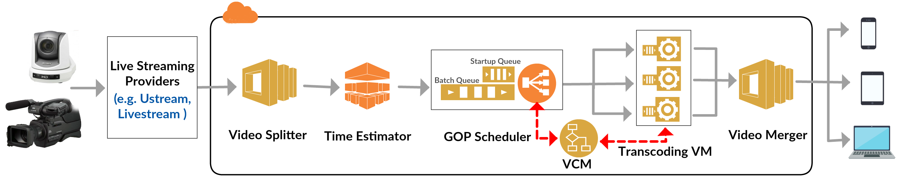

# VLSC: Video Live Streaming Using Cloud Services

The VLSC architecture includes includes six main components, namely ```video splitter```, ```time estimator```, ```task (i.e., GOP) scheduler```, ```transcoding virtual machines (VM)```, ```VM provisioner```, and ```video merger```.

```video splitter``` splits a video into GOPs, which can be transcoded independently. The code for video segmentation can be downloaded [here](https://github.com/lxb200709/videotranscoding_gop). Also, the benchmark videos can be downloaded [here](https://goo.gl/TE5iJ5).

The main contributions of this project are a QoS-aware scheduling method for ```task (i.e., GOP) scheduler``` and GOP transcoding time estimation model for ```time estimator```.



## How to use it in Eclipse

#### Step1: Download and import project
```bash
File -> Import -> Maven -> Existing Maven Projects -> browse the location of cloudsim-projects/module
```
#### Step2: Download dependent jars through Maven
```bash
Right click module -> Maven -> Update Projects
Right click module -> Run As -> Maven build ... -> Goals ("clean install") -> Run
```

## Project structure

This project includes four module:
```bash
  * cloudsim
  * cloudsim-example
  * cloudsim-impl
  * cloudTranscodingApp
```
```cloudsim``` and ```cloudsim-example``` module are from original cloudsim package, more information can be found on the CloudSim's web site.

```cloudsim-impl``` module mainly implements broker and datacenter for scheduling, it contains class extends class from cloudsim (e.g. TranscodingBroker extends DatacenterBroker, VideoSegment extends Cloudlet...)

```cloudTranscodingApp``` includes the main function where the whole simulation starts. The system reading video requests through here. Resource provisioning is also implemented in this module.

How to test

Define command lines.
```java
String[] args = {"-property", "/your/directory/to/put/config.properties",    //location to store property file
                 "-input", "/your/directory/to/put/inputdata",               //location of inputdata
                 "-output", "/your/directory/to/put/output.txt",             //location for outputdata
                 "-estoutput", "/Users/lxb200709/Documents/TransCloud/jarfiles/outputdata/time_comparison.txt",  //location of estimated time text file.
                 "-sortalgorithm", "SDF",          //sorting algorithm
                 "-startupqueue",                  //whether includes startup queue or not
                 "-stqprediction",                 //whether include startup queue prediction or not
                 "-videonum", "500",               //video request number
                 "-vmqueue", "1",                  //vm local queue length
                 "-vmNum", "0",                    //vm number, "0" means dynamic
                 "-vmfrequency", "10000",          //vm provisioning frequency
                 "-goplength", "AVERAGE",          //gop length
                 "-upthreshold", "0.10",           //provisioning upper threadshold
                 "-lowthreshold", "0.05",          //provisioning lower threadshold
                 "-testPeriod", "1200000",         //Test period
                 "-rentingTime", "100000",         //vm renting time
                 "-seedshift", "2"};
 ```
## Download

The downloaded package contains all the source code, examples, jars, and API html files.

## Publications
* **Xiangbo Li**, Mohsen Amini Salehi, Magdi Bayoumi, [VLSC: Video Live Streaming Based On Cloud Services](http://hpcclab.org/paperPdf/bdcloud16/BDCloud16-livestreaming.pdf), Accepted in the 6th IEEE International Conference on Big Data and Cloud Computing Conference (BDCloud ’16), Atlanta, GA, USA, Oct. 2016.
* Mohsen Amini Salehi, **Xiangbo Li**, HLSaaS: High-Level Live Video Streaming as a Service, Presented in Stream2016 workshop, Washington DC, USA, Mar. 2016.

## Licence

Developed by [Xiangbo Li](https://www.linkedin.com/in/xiangbo-li-2893582a)

